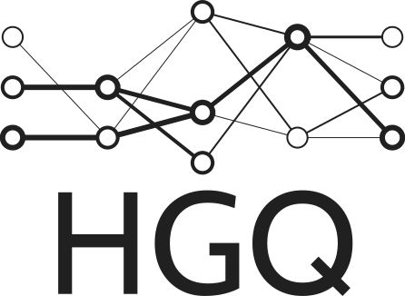

# High Granularity Quantization

[](LICENSE)
[](https://calad0i.github.io/HGQ/)
[](https://badge.fury.io/py/hgq)


HGQ is an gradient-based automatic bitwidth optimization and quantization-aware training algorithm for neural networks to be deployed on FPGAs, By laveraging gradients, it allows for bitwidth optimization at arbitrary granularity, up to per-weight and per-activation level.


Compare to the other heterogeneous quantization approach, like the QKeras counterpart, HGQ provides the following advantages:

- **High Granularity**: HGQ supports per-weight and per-activation bitwidth optimization, or any other lower granularity.
- **Automatic Quantization**: By setting a resource regularization term, HGQ could automatically optimize the bitwidth of all parameters during training. Pruning is performed naturally when a bitwidth is reduced to 0.
- **Bit-accurate conversion** to `hls4ml`: You get exactly what you get from `Keras` models from `hls4ml` models. HGQ provides a bit-accurate conversion interface, proxy models, for bit-accurate conversion to hls4ml models.
  - still subject to machine float precision limitation.
- **Accurate Resource Estimation**: BOPs estimated by HGQ is roughly #LUTs + 55#DSPs for actual (post place & route) FPGA resource consumption. This metric is available during training, and one can estimate the resource consumption of the final model in a very early stage.

Depending on the specific [application](https://arxiv.org/abs/2006.10159), HGQ could achieve up to 20x resource reduction compared to the `AutoQkeras` approach, while maintaining the same accuracy. For some more challenging [tasks](https://arxiv.org/abs/2202.04976), where the model is already under-fitted, HGQ could still improve the performance under the same on-board resource consumption. For more details, please refer to our paper (link coming soon).

## Installation

You will need `python>=3.10` and `tensorflow>=2.13` to run this framework. You can install it via pip:

```bash
pip install hgq
```

## Usage

Please refer to the [documentation](https://calad0i.github.io/HGQ/) for more details.
