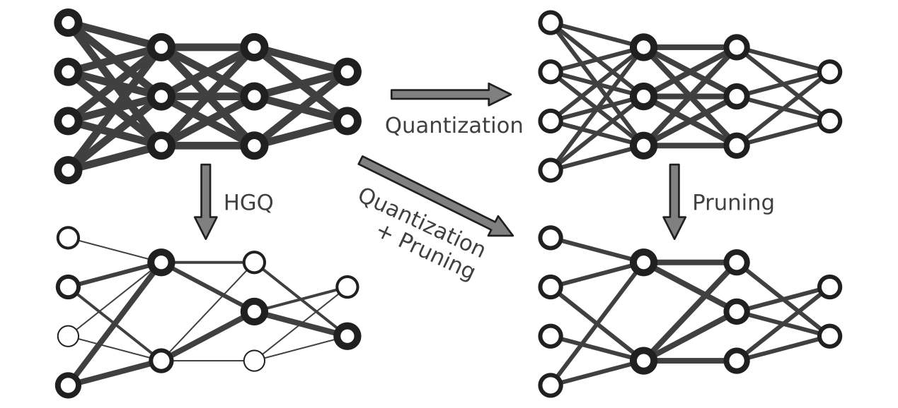

.. High Granularity Quantization documentation master file, created by
   sphinx-quickstart on Sat Nov 25 16:28:11 2023.
   You can adapt this file completely to your liking, but it should at least
   contain the root `toctree` directive.

===========================
High Granularity Quantization
===========================

.. image:: https://img.shields.io/badge/license-Apache%202.0-green.svg
   :target: LICENSE
.. image:: https://github.com/calad0i/HGQ/actions/workflows/sphinx-build.yml/badge.svg
   :target: https://calad0i.github.io/HGQ/
.. image:: https://badge.fury.io/py/hgq.svg
   :target: https://badge.fury.io/py/hgq

HGQ is an gradient-based automatic bitwidth optimization and quantization-aware training algorithm for neural networks to be deployed on FPGAs, By laveraging gradients, it allows for bitwidth optimization at arbitrary granularity, up to per-weight and per-activation level.

.. rst-class:: light

Compare to the other heterogeneous quantization approach, like the QKeras counterpart, HGQ provides the following advantages:

- **High Granularity**: HGQ supports per-weight and per-activation bitwidth optimization, or any other lower granularity.
- **Automatic Quantization**: By setting a resource regularization term, HGQ could automatically optimize the bitwidth of all parameters during training. Pruning is performed naturally when a bitwidth is reduced to 0.
- **Bit-accurate conversion** to `hls4ml`: You get exactly what you get from `Keras` models from `hls4ml` models. HGQ provides a bit-accurate conversion interface, proxy models, for bit-accurate conversion to hls4ml models.
  - still subject to machine float precision limitation.
- **Accurate Resource Estimation**: BOPs estimated by HGQ is roughly #LUTs + 55#DSPs for actual (post place & route) FPGA resource consumption. This metric is available during training, and one can estimate the resource consumption of the final model in a very early stage.

Depending on the specific `application <https://arxiv.org/abs/2006.10159>`_, HGQ could achieve up to 20x resource reduction compared to the `AutoQkeras` approach, while maintaining the same accuracy. For some more challenging `tasks <https://arxiv.org/abs/2202.04976>`_, where the model is already under-fitted, HGQ could still improve the performance under the same on-board resource consumption. For more details, please refer to our paper (link coming soon).

Index
=========================================================

.. toctree::
   :maxdepth: 2
   :caption: Contents:

   status.md
   install.md
   getting_started.md
   reference.md
   qkeras.md
   tips.md
   faq.md

.. toctree::
    :hidden:
    :glob:
    :caption: Autogenerated API Reference

    autodoc/HGQ.layers
    autodoc/HGQ.proxy
    autodoc/HGQ.quantizer
    autodoc/HGQ.utils

Indices and tables
==================

* :ref:`genindex`
* :ref:`modindex`
* :ref:`search`
